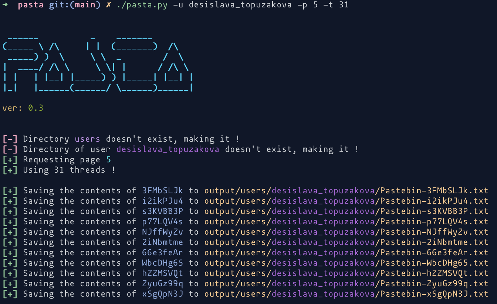
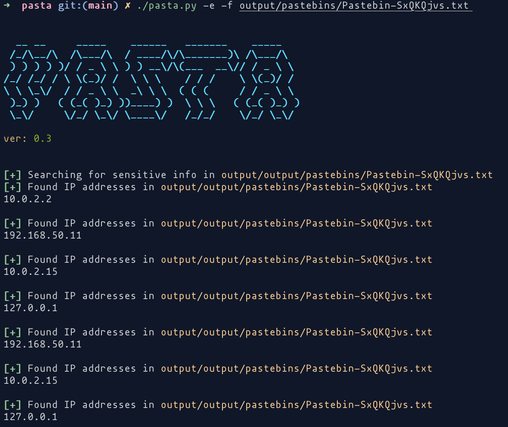

Only scraped the first pages and saves as the link name and no other info, so sorta useful.
https://github.com/Kr0ff/Pasta
# Overview
Pasta is a python 3 tool which performs PasteBin scraping without the use of PasteBin's scraping API. This makes Pasta free and doesn't require an acccount making it suitable for everyone.

It is not as powerful as the PastaBin scraping API but should suffice with providing enough information to look for usernames, passwords, emails, IP addresses and maybe more.

[](https://opensource.org/licenses/MIT)
[](https://github.com/Kr0ff/PenDock/issues)

[](https://twitter.com/CptXrat)
[](https://github.com/Kr0ff)

# Features

* Ability to generate random 8 characters long strings similar to those identifying real PasteBin entries


* Ability to use the randomly generated strings and bruteforce PasteBin for possible hidden valid pastebins 


* Ability to view the contents of PasteBin entry


* Ability to scrape the most recent archive of PasteBin


* Ability to look for sensitive information in downloaded pastebins [emails, usernames, IP addresses]


* Ability to retrieve all pastebins of user's account from all available pages



* Ability to select which file to search for sensitive information



* Ability to select how many threads you want to use [-s, -d, -u] 

# Installation

Installing the tool is as simple as running the following commands in the terminal:

```sh
git clone https://github.com/Kr0ff/Pasta
cd pasta
chmod +x pasta.py
./pasta -h
```

This should greet you with the help menu of the tool

```
 ______ _______  ______ _______ _______
(_____ (_______)/ _____|_______|_______)
 _____) )______( (____     _    _______
|  ____/  ___  |\____ \   | |  |  ___  |
| |    | |   | |_____) )  | |  | |   | |
|_|    |_|   |_(______/   |_|  |_|   |_|

ver: 0.3


usage: pasta.py [-h] [-s] [-r RANGE_STR] [-c CHECK] [-g] [-d] [-e] [-u USERBIN] [-p PAGE] [-f FILE] [-t THREADS]

Pasta - A PasteBin Scraper

optional arguments:
  -h, --help            show this help message and exit
  -s, --search          Search PasteBin with a set of strings
  -r RANGE_STR, --range_str RANGE_STR
                        How many strings to generate
  -c CHECK, --check CHECK
                        Check contents of a specific PasteBin entry
  -g, --get_archive     Get most recent PasteBin archive
  -d, --scrape          Scrape the most recent archive and save each Pastebin
  -e, --sensitive       Search for sensitive info from downloaded Pastebins
  -u USERBIN, --userbin USERBIN
                        Retrieve the PasteBin posts of a user
  -p PAGE, --page PAGE  Page number of user's PasteBins
  -f FILE, --file FILE  Search PasteBin with a set of strings
  -t THREADS, --threads THREADS
                        How many threads to use
```

# Liability
This script has been created for academic purposes only and the developer takes no responsibility of its use !
