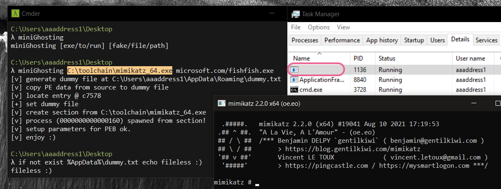

# miniGhosting

it's an easier edition PoC to learn Process Ghosting in ~200 lines :)  
This amazing technique created by Hasherezade, see more [process_ghosting](https://github.com/hasherezade/process_ghosting)

