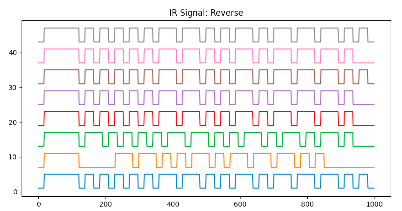
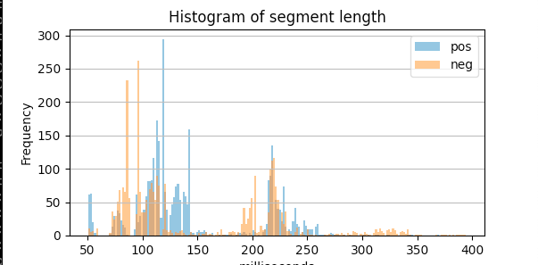

# Flipper File Toolbox #

Random scripts and links for generating Flipper Zero data files.

(An occasional work in Progress)

These scripts are mostly "works for me" level testing, pull requests welcome

## Tools ##

#### [nfc_prox2flip.py](nfc_prox2flip.py) ####

Python script to convert proxmark json dump into Flipper NFC Save File

>`nfc_prox2flip.py test_dat/mf-classic-1k-23AD7C86.json > mfc1k-23AD7C86.nfc`

---

#### [subghz_create_dat.py](subghz_create_dat.py) ####

Based on @[jinschoi](https://gist.github.com/jinschoi)'s [create_sub.py](https://gist.github.com/jinschoi/f39dbd82e4e3d99d32ab6a9b8dfc2f55)

Python script to generate Flipper RAW .sub files from 01 bitstreams

Added :
* FSK support
* insteon (funtional)
* FAN-11T Remote Control of Harbor Breeze Fan (Brute Force)

---

#### [subghz_gen_cmd.py](subghz_gen_cmd.py) ####

A command line based Python script to generate Flipper RAW .sub files

Usage: 

```
subghz_gen_cmd.py [-h] [-v] [-o OUT_FILE] [-f SEND_FREQ] [-0 ZERO_LEN] [-1 ONE_LEN] [-i] 
                  [-b BAUD_RATE] (-H HEX_DATA | -B BIN_DATA) [-p MOD_PRESET] [-m] 
		  [-r REPEAT_CNT] [-d DELAY_PADDING]
```

Example:

>`subghz_gen_cmd.py -f 302500000 -0 333 -1 333 -m -B 0110100001000`

---

#### [nfc_gen_url.py](nfc_gen_url.py) ####

Generates NFC with URL address data and outputs Flipper NFC "save" file format

>`nfc_gen_url.py https://youtu.be/dQw4w9WgXcQ "Rick Roll" > rick_roll.nfc`

see file [rick_roll.nfc](nfc/Rick_Roll.nfc)

Note: requires [ndeflib](https://github.com/nfcpy/ndeflib) (available on [pypi](https://pypi.org/project/ndeflib/))

---

#### [ir_plot.py](ir_plot.py) ####


Plot signal data from flipper IR raw data save files

Usage: 

```
ir_plot.py [-h] [-v] [-n CMD_NAME] [-f FILENAME] 
           [-i] [-d DESTDIR] [-o {png,pdf,svg}] [-s]
```

>`ir_plot.py IR/Lego_Train.ir Reverse`

Will split signal into retransmition samples and plot separately (see code for other options)

---

#### [ir_gen_all_codes.py](ir_gen_all_codes.py) ####

Generates file Flipper IR file will all command codes for a given address

>`ir_gen_all_codes.py.py RC5 03 00`

Will generate filename [IR-CMD-RC5-03.ir](IR/IR-CMD-RC5-03.ir)

---

#### [subghz_histogram.py](subghz_histogram.py) ####


Script to read Flipper SubGhz RAW File and plot 0 & 1 segment lengths using pyplot

Based on @[jinschoi](https://gist.github.com/jinschoi)'s [histogram_sub.py](https://gist.github.com/jinschoi/8396f25a4cb7ac7986a7d881026ae950)
and modified to plot 0 & 1 segments separately.

>`subghz_histogram.py sample.sub`

---

#### [subghz_preset_gen.py](subghz_preset_gen.py) ####

Generates CC1101 "SubGhzPresetCustom" settings


Usage:

```
subghz_preset_gen.py [-h] [-p {AM270,AM650,FM238,FM476}] [-pr] [-sw SYNC_WORD] [-sm SYNC_MODE]
			[-mod {2FSK,4FSK,GFSK,MSK,OOK}] [-lc {Fixed,Infinite,Variable}]
		        [-pl PKT_LEN] [-v] [-n CONF_NAME] [-if INTERMEDIATE_FREQ] [-dr DATA_RATE]
			[-fr FREQUENCY] [-bw BAND_WIDTH] [-np NUM_PREAMBLE] [-dev DEVIATION]
			[-cs CHANNEL_SPACING] [-man] [-crc {on,off}] [-dw {on,off}]
```

<details><summary>Info:</summary>

The following loads Preset 2FSKDev238Async sets FM deviation to 6000 Hz and turns on manchester encoding

> `subghz_preset_gen.py  -p  FM238  --deviation 6000 -pr --manchester`

Generates:

```
Custom_preset_name: NewPreset
Custom_preset_module: CC1101
Custom_preset_data: 02 0D 07 04 08 32 0B 06 10 67 11 83 12 0C 13 02 14 00 15 17 18 18 19 16 1B 07 1C 00 1D 91 20 FB 21 56 22 10 00 00 C0 00 00 00 00 00 00 00
```

</details>


---

#### [subghz_decode_presets.py](subghz_decode_presets.py) ####

Decodes CC1101 "SubGhzPresetCustom" settings from Flipper saved sample file or settings_user (subghz/assets/setting_user) file.

> `subghz_decode_presets.py test_dat/Raw_Sample.sub`

for more info see the CC1101 Datasheet [cc1101.pdf](https://www.ti.com/lit/ds/symlink/cc1101.pdf)

<details><summary>Info:</summary>
Reads:

```
Filetype: Flipper SubGhz RAW File
Version: 1
Frequency: 433920000
Preset: FuriHalSubGhzPresetCustom
Custom_preset_module: CC1101
Custom_preset_data: 02 0D 03 07 08 32 0B 06 14 00 13 00 12 30 11 32 10 17 18 18 19 18 1D 91 1C 00 1B 07 20 FB 22 11 21 B6 00 00 00 C0 00 00 00 00 00 00
```

Generates:

```
FuriHalSubGhzPresetCustom

as_tuples:
[   ('IOCFG0', 13), ('FIFOTHR', 7), ('PKTCTRL0', 50), ('FSCTRL1', 6),
    ('MDMCFG4', 23), ('MDMCFG3', 50), ('MDMCFG2', 48), ('MDMCFG1', 0),
    ('MDMCFG0', 0), ('MCSM0', 24), ('FOCCFG', 24), ('AGCCTRL2', 7),
    ('AGCCTRL1', 0), ('AGCCTRL0', 145), ('WORCTRL', 251), ('FREND1', 182),
    ('FREND0', 17), ('PATABLE', [0, 192, 0, 0, 0, 0, 0, 0])]

rf_conf
    Intermediate_freq:        152343.75 Hz
    Modulations:              OOK
    Data_Rate:                3793.72 Hz
    Bit_Width:                263.59 ms
    Channel_Bandwidth:        650000.00 Hz
    Sync_Mode:                SYNCM_NONE
    Channel_spacing:          25390.62 Hz
    Manchester:               0
    Variable_length_packet:   Infinite packet length
    Enable_Pkt_CRC:           0
    Pkt_DataWhitening         0
    Min_TX_Preamble:          0
    PA_Table:                 [0, 192, 0, 0, 0, 0, 0, 0]

```

Eventually this will be able to read a config file and generate "Custom_preset" radio settings.

*WARNING : this is shit code and still needs a lot of work and cleanup. (I'm surprised it works)*

</details>

---

#### [nfc_hexdump.py](nfc_hexdump.py) ####

reads Flipper NFC dump and adds ascii and hex to RFID HEX dump (for easier file analysis)

>`nfc_hexdump.py nfc/Rick_Roll.nfc`

<details><summary>Info:</summary>

In:
```
    Page 4: 03 29 91 01
    Page 5: 15 55 04 79
    Page 6: 6F 75 74 75
    Page 7: 2E 62 65 2F
```

Out:
```
    Page 4: 03 29 91 01 #   - ) - -         3  41 145   1
    Page 5: 15 55 04 79 #   - U - y        21  85   4 121
    Page 6: 6F 75 74 75 #   o u t u       111 117 116 117
    Page 7: 2E 62 65 2F #   . b e /        46  98 101  47
```

</details>

---

### [NFC](nfc) ###

Random Collection of flipper [NFC signals files](nfc)

---

### [IR](IR) ###

Random Collection of flipper [IR signal files](IR)

---

### [Subghz](subghz) ###

A Collection of Generated [Subghz Signal Files](subghz)

---

## See Also: ##

* [Flipper Zero Official Forum](https://forum.flipperzero.one/) :
	Community of Flipper Zero Users & Developers.

* [flipperzero_cmd](https://github.com/evilpete/flipperzero_protobuf_py) :
        A command line based tool for file transfer and remote command <br> *(Work in Progress)*

* [Brute-Force CAME 12bit Gate Codes](https://github.com/BitcoinRaven/CAMEbruteforcer)
        Generate sub files which have all the possible keys combination for CAME gate

* [FlipperScripts](https://github.com/DroomOne/FlipperScripts.git) :
	Reads the `DolphinStoreData` struct from `dolphin.state` files.

* [create_sub.py](https://gist.github.com/jinschoi/f39dbd82e4e3d99d32ab6a9b8dfc2f55) :
	Python script to generate Flipper RAW .sub files from OOK bitstreams.

* [bitstream-from-sub.py](https://gist.github.com/jinschoi/40a470e432c6ac244be8159145454b5c) :
	Decode raw bitstring captured Flipper RAW .sub file.

* [csv2ir](https://github.com/Spexivus/csv2ir) :
	csv2ir is a script to convert ir .csv files to .ir files for the flipper.

* [flipperzero-goodies](https://github.com/wetox-team/flipperzero-goodies) :
	More scripts resources

* [awesome-flipperzero](https://github.com/djsime1/awesome-flipperzero) :
	Another collection of links for the Flipper Zero device.

* [flipperzero-firmware](https://github.com/Eng1n33r/flipperzero-firmware.git) :
	Flipper Zero's Custom Firmware with max features.

* [Flipper Zero Hacking 101](https://flipper.pingywon.com/) :
	*yet another* collection of links.
