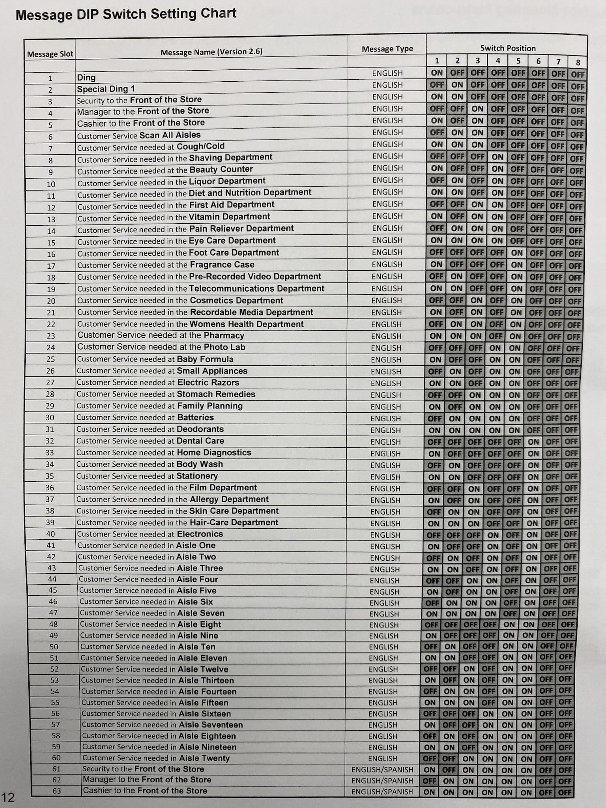
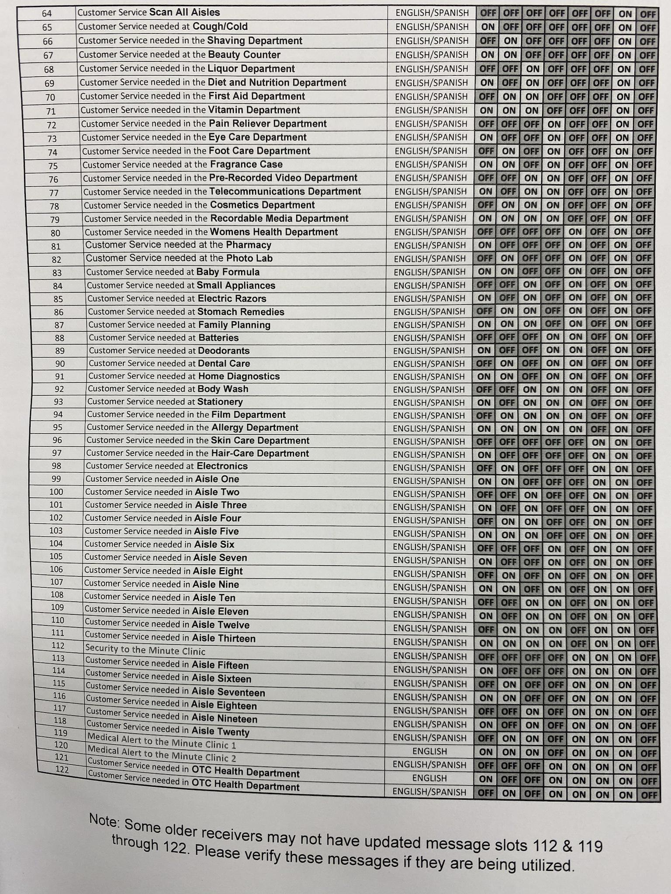

# CVS Customer Service Buttons

The CVS customer assitance service buttons contain a 10-dipswitch selector.
This button operates on  433mhz. The 10th dipswitch decides which channel it will transmit on. Most stores use the 0/Off position which is 433.92.

Dipswitches 1-8 set the department/message and the 9th dipswitch is always 0/Off and is unused.

     
