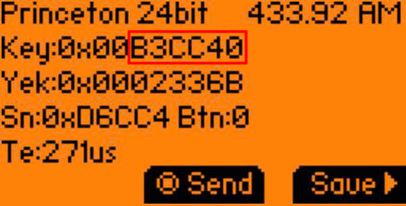
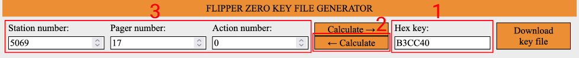
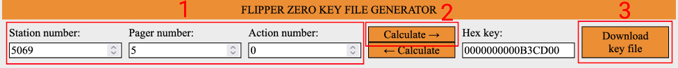
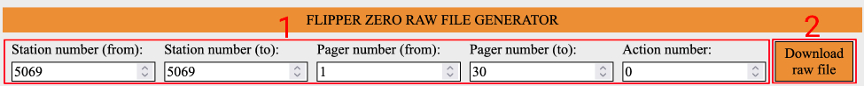

# Pagger
A collection of scripts to generate Sub-GHz raw files compatible with the Flipper Zero to handle restaurants/kiosks pager systems.

### Supported systems:
[Retekess T119](https://meoker.github.io/pagger/retekess-t119/retekess-t119.html)\
[Retekess TD174](https://meoker.github.io/pagger/retekess-td174/retekess-td174.html)

### How to use:
Get your Flipper Zero, go to **_Sub-GHz_** -> **_Read_** and try to detect some useful signal:

Once you get your key, go to the related Pagger generator and write it down in the form, you will be able to calculate back the station, pager and action numbers:

From there you can generate a single key file for a single pager:

or a combo raw file for multiple pagers: 

### Why not a bruteforcer:
TLDR; Nobody got time for that!

Long version: from my research I found that the first transmitted bits are an encoded number that defines the transmitter station.
This number is probably randomly generated the first time the station is turned on and I think it's used to avoid collisions with devices of the same type in the same area.\
If my calculations are correct, with 13/15 bits you can have 8191/32767 possible station numbers, so you should loop through all of these numbers if you want to find yours.\
The problem now is that for each station number, you should also loop through all of its pagers numbers and obviously this is time-consuming.
In my tests, calling 10 pagers for 1000 stations took ~1h on my Flipper Zero, so do your math!\
That said, the other bruteforcers I found online never worked.

### Contribute:
If you have a new generator, please PR it.\
If you simply have key/raw files of an unsupported system, open a new Issue with brand, model, pager number and as much info as you can have, this will help the community to work on it.\
At the moment I have no time or interest to develop a Flipper Zero app.\
Feel free to use this code to build your own project, in that case let me know, I'd like to check it out!

### Disclaimer:
I developed these scripts for research purposes.\
I don't endorse any attack that could damage any public service, so please use it responsibly.

### Credits:
Thanks to [ShotokanZH](https://github.com/ShotokanZH) for his awesome work with [flipper_sub_plotters_comparers](https://github.com/ShotokanZH/flipper_sub_plotters_comparers).\
Thanks to [zProAle](https://github.com/zproale) for his support with TD174 pager system.